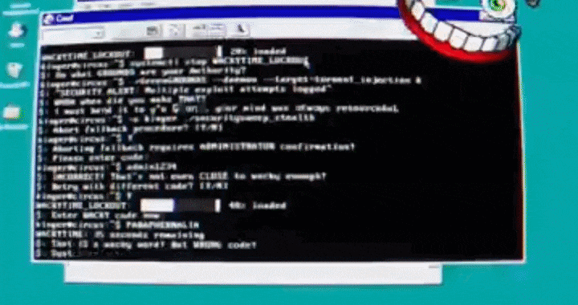
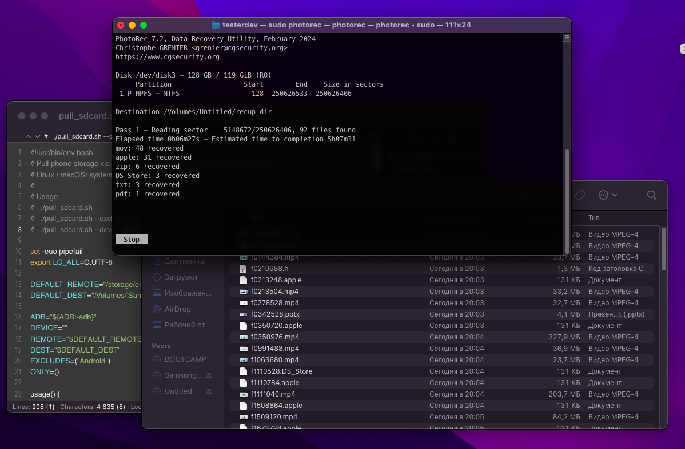
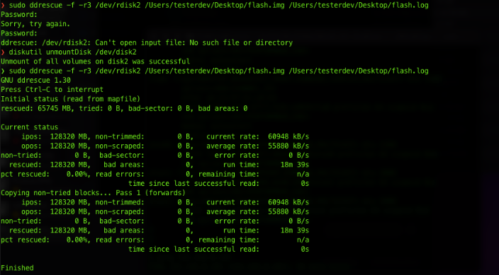
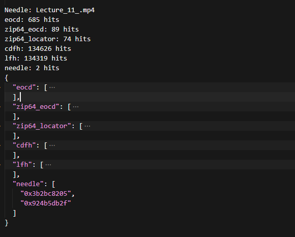
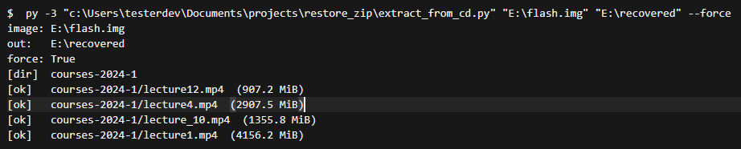
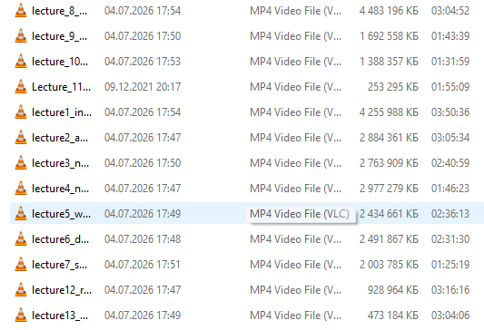

# Кажется… я случайно убил свои материалы…

Как после `rm -rf` удалось достать 28 ГБ ZIP с материалами курса, которые для меня были критичны

Момент потери был чистой случайностью: маленькая ошибка в `rm -rf`, кавычки не там, где нужно, снесла данные с настоящего тома, а каталог с кавычками в имени остался нетронутым. Судорожное Ctrl+C не спасло: я смотрел на открытую вкладку с файлами и видел, как они один за другим исчезают. Не передать словами.

Это очень похоже на финал мультсериала «Удивительный цифровой цирк»: персонаж Королёр в панике пытается остановить процесс, но одно неверное движение, и случайно нажатый Delete запускает удаление. Судорожная отмена уже не возвращает то, что исчезло.



Сначала я обратился к простому решению: к первоисточнику и знакомым, у которых мог остаться этот курс. Оказалось, что все ссылки уже закрыты, а у себя знакомые всё подчистили из-за ненадобности.

Пришлось возвращаться к удалённой флешке. Первое и главное: снять образ, чтобы случайно не испортить пустую флешку записью лишних файлов. Новые данные могут затереть кластеры, где ещё лежит то, что мы пытаемся вернуть.

## Восстановление утилитой PhotoRec

Для первой попытки вернуть данные я использовал PhotoRec. Он сканирует носитель по сигнатурам, не опираясь на exFAT.

Процесс занял ~10 часов. На середине флешка отвалилась по USB, скан пришлось запустить заново. В итоге получил много файлов, но без нормальной структуры: обрывки, `recup_dir/...`, куча битых ZIP. Нужного архива ~28 ГБ среди них не было.

Платные аналоги вроде MiniTool Power Data Recovery или R-Studio я сознательно не ставил в центр истории: они платные, а в моей ситуации (`rm -rf`, exFAT, один большой ZIP64) скорее всего упёрлись бы в ту же стену.



## Поиск архива в образе диска по сигнатурам

Идея carving у меня появилась не на этой флешке. Годы назад на одном из прошлых проектов прод обнулили, данные на сервере считались потерянными. Коллега предложил не ждать чуда от бэкапов, а разобрать образ диска вручную: искать в сыром дампе записи по известному паттерну и проверять соседние поля.

«Долго, но шанс есть». Так и вышло: нужные данные удалось вернуть. На флешке с ZIP тот же приём, другой формат, та же схема.

## Что осталось на exFAT после `rm -rf`

`rm -rf` на exFAT не затирает гигабайты данных мгновенно. Меняется каталог: где файл начинался и сколько занимал. Если после удаления ничего не записывали, кластеры с ZIP часто физически на месте. Гарантии нет, но для архива, который не успели перезаписать, шанс реальный.

**Первое правило:** ничего не создавать на флешке и по возможности не вставлять её в устройства, которые сами что-то пишут на носитель (Android, Smart TV и т.п.).

**Второе правило:** лучше сразу снять образ и дальше работать с файлом образа, а не с флешкой.

Сначала том нужно размонтировать (`diskutil unmountDisk` на macOS). Затем:

```bash
sudo dd if=/dev/rdisk4 of=~/flash.img bs=8m status=progress
```

`/dev/rdisk4` — номер устройства с вашего Mac (`diskutil list`). `rdisk` обычно быстрее обычного `disk`. На выходе один файл `flash.img`, с которым дальше работаем только в софте, не трогая флешку.

Образ у меня вышел ~119 GiB. USB пару раз отваливался, `dd` обрывался, пришлось перейти на `ddrescue`: он дописывает образ с места обрыва и ведёт `.log`, так что после переподключения флешки не начинать с нуля.



## Самописный сканер `zip_carver`

ZIP устроен так: сначала идут сами файлы (гигабайты видео), а в самом конце архива — каталог с именами и смещениями и служебная запись «конец архива» (`PK\x06\x06`). После `rm -rf` exFAT уже не знает, где лежал ZIP, но этот блок в конце файла на флешке часто ещё на месте, если носитель не перезаписывали.

Образ `flash.img` у меня был. Вопрос один: данные ещё там или уже затёрли? PhotoRec ответил косвенно: много мусора, нужного архива нет. Дальше свой проход.

`zip_carver.py` — не восстановитель, а просмотрщик сырого образа. Ищет метки ZIP; для каждого места, где в образе встретился конец архива (`PK\x06\x06`), пробует сложить пазл: где начало, где конец, читается ли каталог, попадает ли известное имя файла. Черновик набросал в Cursor; смещения, hex и «верить ли rank 0» сверял сам. Библиотек нет: `struct`, `open(..., "rb")`, чтение кусками по 8 МБ. 119 GiB в RAM не лезут.

Пример ядра прохода:

```python
SIG_EOCD = b"PK\x05\x06"       # конец архива
SIG_Z64_EOCD = b"PK\x06\x06"   # ZIP64 EOCD
SIG_CDFH = b"PK\x01\x02"       # central directory
SIG_LFH = b"PK\x03\x04"        # локальный заголовок
CHUNK = 8 * 1024 * 1024
DEFAULT_NEEDLE = b"Lecture_11.mp4"

tail = b""
while True:
    chunk = f.read(CHUNK)
    if not chunk:
        break
    buf = tail + chunk
    base = file_offset - len(tail)
    for pos in find_all(buf, SIG_Z64_EOCD):
        counts["zip64_eocd"].append(base + pos)
    if needle:
        for pos in find_all(buf, needle):
            counts["needle"].append(base + pos)
    tail = buf[-256:]
    file_offset += len(chunk)
```

Скрипт не распаковывает ZIP, а просто собирает адреса: где на диске встретились сигнатуры и известное имя лекции. `tail` в конце цикла нужен, чтобы не пропустить `PK`, разорванный между двумя чанками.

Далее нужно запастись терпением: чтобы найти корректную адресацию, придётся дважды прогнать образ через скрипт.

### Проход 1: «есть ли следы»

```powershell
py -3 zip_carver.py E:\flash.img --signatures-only
```

Скрипт один раз читает образ и печатает счётчики, без извлечения и без сотен догадок.

```text
Needle: Lecture_11.mp4
zip64_eocd: 89 hits
needle: 2 hits
  "needle": ["0x3b2bc8205", "0x924b5db2f"]
```

Имя лекции на образе встречается дважды. Подписей «конец архива» нашлось 89. Если бы было `needle: 0`, дальше бы не копал: либо имя в архиве другое, либо данные уже затёрты.



### Проход 2: список кандидатов

```powershell
py -3 zip_carver.py E:\flash.img
```

```text
Candidates: 676
```

676 — это столько «версий архива» скрипт насчитал по всему образу. Дальше смотрим, какая из них живая.

Для каждой сигнатуры `PK\x06\x06` скрипт строит гипотезу: если этот конец архива настоящий, то данные лежат отсюда до сюда, каталог тут, размер примерно такой.

Первый в списке, rank 0. В JSON выглядит убедительно:

```json
{
  "rank": 0,
  "archive_size_gb": 39.94,
  "notes": [
    "no valid cdfh in cd preview",
    "needle_in_archive@0x3b2bc8205"
  ]
}
```

Тут важны `archive_size_gb` и `notes`. Размер не бьётся с ожидаемым, в notes нет нормального каталога — значит, красивый первый кандидат нам не подходит.

Ждали ~28 ГБ, вышло ~40. Каталог не читается (`no valid cdfh`). Первый hit `0x3b2bc8205`: строка нашлась где-то внутри большого куска, а не в каталоге в конце образа. Строка `Lecture_11...` на 128 ГБ может встретиться и в каталоге, и случайно внутри MP4. `--extract 0` не запускал.

### Второй needle и разбор каталога

Смотрю второй hit из прохода 1, `0x924b5db2f`. В том же логе рядом:

```text
needle:     0x924b5db2f
zip64_eocd: 0x924b5e161
```

756 байт между ними. Из EOCD читаю: каталог 2085 байт прямо перед ним.

```text
0x924b5e161 − 2085 = 0x924b5d93c

0x924b5d93c  ≤  0x924b5db2f  <  0x924b5e161
     ↑              ↑              ↑
  начало CD    2-й needle      ZIP64 EOCD
```

Проще говоря: имя лекции попало в каталог в конце архива, а не в случайное место посреди 128 ГБ.

Дальше не полный прогон по 119 GiB, а разбор одного куска каталога. Для этого `parse_cd_zip64.py`: он не ищет архив по всему образу (это уже сделал `zip_carver`), а распарсивает central directory по заданным границам и печатает список файлов.

```python
CD_START = int(sys.argv[2], 0)
CD_END = int(sys.argv[3], 0)

with open(path, "rb") as f:
    f.seek(CD_START)
    cd = f.read(CD_END - CD_START)   # ровно 2085 байт

SIG_CDFH = b"PK\x01\x02"

def parse_cdfh(data: bytes, pos: int):
    if data[pos : pos + 4] != SIG_CDFH:
        return None
    name_len, extra_len, comment_len = struct.unpack_from("<HHH", data, pos + 28)
    local_offset = struct.unpack_from("<I", data, pos + 42)[0]
    name = data[pos + 46 : pos + 46 + name_len]
    extra = data[pos + 46 + name_len : pos + 46 + name_len + extra_len]
    if local_offset == 0xFFFFFFFF:
        local_offset = parse_zip64_extra(extra).get("local_offset", local_offset)
    rec_len = 46 + name_len + extra_len + comment_len
    return local_offset, name.decode("utf-8", "replace"), rec_len

pos = 0
while pos < len(cd):
    parsed = parse_cdfh(cd, pos)
    if not parsed:
        break
    local_offset, name, rec_len = parsed
    print(f"  {local_offset:#x}  {name}")
    pos += rec_len
```

Три аргумента после пути к образу — границы каталога, которые мы только что вычислили из EOCD. Скрипт читает 2085 байт и печатает имена файлов со смещениями внутри архива.

```powershell
py -3 parse_cd_zip64.py E:\flash.img 0x924b5d93c 0x924b5e161 0x924b5e1ad
```

```text
entries: 17
CD: 0x924b5d93c .. 0x924b5e161
  0x0  courses-2024-1/
  0x35  courses-2024-1/lecture12.mp4
  ...
  0x1b26b81d9  courses-2024-1/Lecture_11.mp4 <--
  ...
```

17 записей, папка `courses-2024-1/` со всеми лекциями курса. Второй needle оказался в каталоге архива, там, где ZIP хранит список файлов, а не внутри видео.



## Вытаскивание файлов

Список из `parse_cd_zip64.py` — это уже план работ: для каждой строки известны имя, смещение внутри архива, размер. Осталось прочитать байты с образа и записать MP4 на диск.

Первой попыткой я резал файлы, опираясь на локальный заголовок (LFH, `PK\x03\x04`). Он стоит прямо перед данными каждого файла. Логика простая: нашёл LFH, прочитал `comp_size`, скопировал столько байт.

Все MP4 вышли примерно одного размера (~1,4 ГБ), хотя лекции явно разные. Windows Media Player отказался их открывать; VLC на конечных фрагментах видео тоже ругался.

LFH и CDFH оба лежат на образе, но в разных местах. LFH — заголовок у каждого файла внутри архива, CDFH — та же информация в каталоге в конце ZIP. В норме они совпадают; на убитой флешке не всегда. У меня заголовки у MP4 врали одинаковым размером, а записи в каталоге в конце — нет. Для извлечения использовал `extract_from_cd.py`:

```python
method, local_offset, comp_size, _, name, _ = parse_cdfh(cd, pos)  # размер из каталога
data_off = lfh_data_offset(f, ARCHIVE_START + local_offset)        # где начинаются данные
raw = f.read(comp_size)                                            # comp_size из CDFH, не из LFH
```

Из каталога берём «сколько байт читать», из LFH — только «где начинается файл». Именно эта смена источника и починила битые MP4.

```powershell
py -3 extract_from_cd.py E:\flash.img E:\recovered --force
```

```text
[ok]   courses-2024-1/Lecture_11.mp4   (247.3 MiB)
[ok]   courses-2024-1/lecture3.mp4      (2636.5 MiB)
...
[ok]   courses-2024-1/lecture12.mp4     (907.1 MiB)
```

Раньше все файлы были ~1,4 ГБ. Теперь размеры разные, как в каталоге, и плеер их принимает.



## Заключение

**Проблема.** С флешки одной командой `rm -rf` пропал ZIP64 ~28 ГБ с материалами курса. Бэкапов нет, ссылки на первоисточник закрыты, у знакомых тоже подчищено.

**Риски.** Любая запись на носитель могла затереть кластеры с ещё живыми данными. Плюс неопределённость: неизвестно, цел ли архив вообще и не переписала ли что-то файловая система после удаления.

**Что сделано.** Сняли образ флешки (`dd` / `ddrescue`), дальше работали только с файлом образа. Своим сканером нашли на образе сигнатуры ZIP и известное имя лекции, отсекли ложный вариант (~40 ГБ без валидного каталога). По второму совпадению нашли настоящий список файлов архива и разобрали его вручную. Файлы вытащили, взяв размеры из этого списка (CDFH).

**Результат.** Восстановлены все 16 лекций, видео нормально открываются в плеере.
